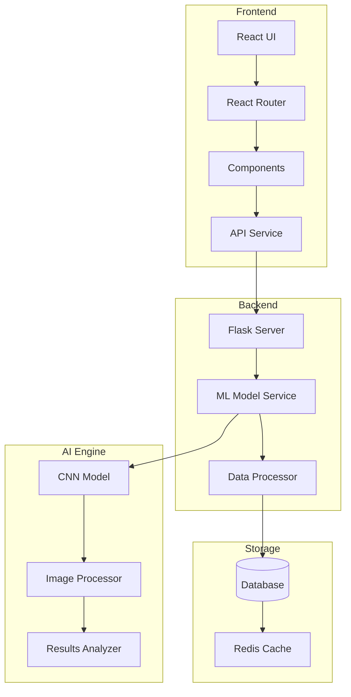

# BrAIn - AI Brain Disease Diagnosis Platform

BrAIn is an advanced AI-powered platform for diagnosing brain diseases through the analysis of MRI brain scans. Our cutting-edge technology assists medical professionals in detecting brain tumors, Alzheimer's disease, and multiple sclerosis with high accuracy.

## Getting Started

These instructions will get you a copy of the project up and running on your local machine for development and testing purposes.

### Prerequisites

- Node.js (v14.0.0 or later)
- npm (v6.0.0 or later)
- Python (v3.8 or later)
- pip (latest version)

### Installation

1. Clone the repository:
   ```
   git clone https://github.com/your-username/brain-project.git
   cd brain-project
   ```

2. Install Node dependencies:
   ```
   npm install
   ```

3. Install Python dependencies:
   ```
   pip install -r requirements.txt
   ```

4. Start the development server:
   ```
   npm start
   ```

5. Start the Python backend:
   ```
   python app.py
   ```

6. Open [http://localhost:3000](http://localhost:3000) to view it in the browser.

## System Architecture



## Built With

- [React](https://reactjs.org/) - The web framework used
- [styled-components](https://styled-components.com/) - For component-level styling
- [React Router](https://reactrouter.com/) - For routing
- [Recharts](https://recharts.org/) - For data visualization
- [Flask](https://flask.palletsprojects.com/) - Backend framework
- [TensorFlow](https://tensorflow.org/) - ML framework

## Contributing

Please read [CONTRIBUTING.md](CONTRIBUTING.md) for details on our code of conduct, and the process for submitting pull requests to us.

## License

This project is licensed under the MIT License - see the [LICENSE.md](LICENSE.md) file for details

## Acknowledgments

* Hat tip to anyone whose code was used
* Inspiration
* etc